# SecureDots Architecture Documentation

<!-- Comprehensive table of contents for complex technical document -->
<details>
<summary>Table of Contents</summary>

- [System Overview](#system-overview)
- [System Architecture](#system-architecture)
  - [High-Level Architecture Diagram](#high-level-architecture-diagram)
  - [Component Interaction Flow](#component-interaction-flow)
- [Component Details](#component-details)
  - [Shell Configuration Layer](#shell-configuration-layer)
  - [AWS Credential Management](#aws-credential-management)
  - [Encryption and Key Management](#encryption-and-key-management)
- [Security Model](#security-model)
  - [Defense-in-Depth Implementation](#defense-in-depth-implementation)
  - [Threat Model and Mitigations](#threat-model-and-mitigations)
- [Operational Architecture](#operational-architecture)
  - [Startup and Initialization Flow](#startup-and-initialization-flow)
  - [Credential Retrieval Flow](#credential-retrieval-flow)
  - [Module Loading Architecture](#module-loading-architecture)
- [Data Flow Architecture](#data-flow-architecture)
  - [Configuration Data Flow](#configuration-data-flow)
  - [Error Propagation Architecture](#error-propagation-architecture)

</details>

<!-- Skip navigation for screen readers -->
<a href="#system-overview" class="sr-only">Skip to main content</a>

## System Overview

This document provides a comprehensive architectural overview of the secure dotfiles system, designed for developers and system administrators who need to understand the technical implementation, security model, and component interactions.

### Accessibility Notice

All diagrams in this document follow WCAG 2.1 AA standards and include comprehensive text descriptions for screen readers.

### Design Philosophy

**Security-First Architecture**: Every component prioritizes credential protection over convenience, implementing defense-in-depth with multiple security layers.

**Zero-Trust Credential Model**: No plaintext secrets exist anywhere in the system. All sensitive data is encrypted at rest and dynamically decrypted only when needed.

**Hardware-Backed Security**: Optional but recommended integration with hardware security keys provides tamper-resistant cryptographic operations.

**Modular Design**: Component separation allows selective deployment and easy maintenance while maintaining security boundaries.

---

## 🏗️ System Architecture

### High-Level Architecture Diagram

*System architecture showing five security layers with data flow connections. Critical security components are indicated by bold borders and patterns rather than color alone.*

```mermaid
graph TB
    subgraph "User Interface Layer"
        A[Terminal/Shell]
        B[AWS CLI]
        C[SSH Client]
        D[Git]
    end
    
    subgraph "Configuration Layer"
        E[.zshrc]
        F[AWS Config]
        G[SSH Config]
        H[Git Config]
    end
    
    subgraph "Security Layer"
        I["🔐 Credential Process"]
        J["🔒 Pass Password Manager"]
        K["🔑 GPG Agent"]
        L["🛡️ Hardware Security Key"]
    end
    
    subgraph "Storage Layer"
        M["💾 Encrypted Password Store"]
        N["🗝️ GPG Keyring"]
        O[Configuration Files]
    end
    
    subgraph "Prevention Layer"
        P[Stow Ignore Patterns]
        Q[Git Ignore Patterns]
        R[File Permissions]
    end
    
    A --> E
    B --> F
    C --> G
    D --> H
    
    F --> I
    I --> J
    J --> K
    K --> L
    
    K --> N
    J --> M
    E --> O
    
    E --> P
    H --> Q
    O --> R
    
    %% ACCESSIBILITY RULE: Only specify color when changing fill
    %% WHITE FILLS: fill:#ffffff,color:#000 (black text on white)  
    %% DEFAULT FILLS: No color override (Mermaid handles contrast)
    
    %% Security Layer - Critical components with white backgrounds need black text
    style I stroke:#000,stroke-width:4px,fill:#ffffff,color:#000,stroke-dasharray:8 4
    style J stroke:#000,stroke-width:4px,fill:#ffffff,color:#000,stroke-dasharray:12 6  
    style K stroke:#000,stroke-width:4px,fill:#ffffff,color:#000
    style L stroke:#000,stroke-width:6px,fill:#ffffff,color:#000,stroke-dasharray:4 4
    
    %% Storage Layer - Mixed: white fills need black text, defaults use Mermaid contrast
    style M stroke:#000,stroke-width:5px,fill:#ffffff,color:#000,stroke-dasharray:2 2
    style N stroke:#000,stroke-width:3px
    
    %% Configuration Layer - White fills need black text
    style E stroke:#000,stroke-width:2px,fill:#ffffff,color:#000
    style F stroke:#000,stroke-width:2px,fill:#ffffff,color:#000
    style G stroke:#000,stroke-width:2px,fill:#ffffff,color:#000
    style H stroke:#000,stroke-width:2px,fill:#ffffff,color:#000
    
    %% Prevention Layer - White fills need black text
    style P stroke:#000,stroke-width:2px,fill:#ffffff,color:#000,stroke-dasharray:1 1
    style Q stroke:#000,stroke-width:2px,fill:#ffffff,color:#000,stroke-dasharray:1 1
    style R stroke:#000,stroke-width:2px,fill:#ffffff,color:#000,stroke-dasharray:1 1
    
    %% User Interface Layer - Default backgrounds, only border styling
    style A stroke:#000,stroke-width:2px
    style B stroke:#000,stroke-width:2px
    style C stroke:#000,stroke-width:2px
    style D stroke:#000,stroke-width:2px
    
    %% Configuration files - White fill needs black text
    style O stroke:#000,stroke-width:2px,fill:#ffffff,color:#000
```



**Accessibility Description:**
This system architecture diagram shows five distinct layers with high-contrast visual patterns:

- **User Interface Layer**: Terminal/Shell, AWS CLI, SSH Client, Git - Standard applications (thin solid borders)
- **Configuration Layer**: .zshrc, AWS Config, SSH Config, Git Config - Configuration files (medium solid borders)  
- **Security Layer**: 🔐 Credential Process (thick dashed border, long dashes), 🔒 Pass Password Manager (thick dashed border, medium dashes), 🔑 GPG Agent (thick solid border), 🛡️ Hardware Security Key (extra-thick dashed border, short dashes) - Critical security components with distinctive border patterns
- **Storage Layer**: 💾 Encrypted Password Store (extra-thick dotted border), 🗝️ GPG Keyring (medium solid border) - Encrypted storage with special borders
- **Prevention Layer**: Stow/Git Ignore Patterns, File Permissions (dotted borders) - Protection mechanisms

**Data Flow Patterns**: Solid arrows show: User interfaces → Configuration → Security processing → Encrypted storage, with additional connections to prevention mechanisms.

### Component Interaction Flow

*Sequence diagram showing the complete interaction flow from user command through all security layers to credential retrieval. Two paths are shown: hardware-backed security and software-only GPG.*

```mermaid
sequenceDiagram
    participant User as 👤 User
    participant Shell as 💻 Terminal/Shell
    participant AWS_CLI as ☁️ AWS CLI
    participant Credential_Process as 🔐 Credential Process
    participant Pass as 🔒 Pass Manager
    participant GPG_Agent as 🔑 GPG Agent
    participant Hardware_Key as 💳 Hardware Key
    participant Encrypted_Store as 💾 Encrypted Store

    User->>Shell: 🚀 Launch terminal
    Shell->>Shell: ⚙️ Load .zshrc configuration
    Shell->>Shell: 🔧 Initialize environment
    
    Note over User, AWS_CLI: User runs AWS command
    User->>AWS_CLI: 📎 aws s3 ls
    AWS_CLI->>Credential_Process: 📥 Request credentials
    
    Credential_Process->>Pass: 🔍 Request aws/profile/access-key
    Pass->>GPG_Agent: 🔓 Request decryption
    
    alt 💳 Hardware Key Present
        GPG_Agent->>Hardware_Key: 🔑 Request private key operation
        Hardware_Key->>Hardware_Key: ☝ Verify PIN/Touch
        Hardware_Key->>GPG_Agent: 🔐 Return cryptographic result
    else 💻 Software-Only GPG
        GPG_Agent->>GPG_Agent: 🔑 Decrypt using software key
    end
    
    GPG_Agent->>Encrypted_Store: 💾 Read encrypted credential
    Encrypted_Store->>GPG_Agent: 💾 Return encrypted data
    GPG_Agent->>Pass: 🔓 Return decrypted credential
    Pass->>Credential_Process: 📤 Return plaintext credential
    
    Credential_Process->>AWS_CLI: 📤 Return JSON credential response
    AWS_CLI->>User: ✅ Execute command with credentials
```



**Sequence Diagram Accessibility Description:**
This interaction sequence shows 8 participants (User, Terminal/Shell, AWS CLI, Credential Process, Pass Manager, GPG Agent, Hardware Key, Encrypted Store) communicating through message arrows. The sequence demonstrates two authentication paths:

**Standard Flow:** User → Shell → AWS CLI → Credential Process → Pass Manager → GPG Agent → Encrypted Store (and return path)

**Hardware Authentication Branch:** When hardware key is present, GPG Agent communicates with Hardware Key for PIN/Touch verification before proceeding.

**Key Steps:**
1. **🚀 Initialization**: Shell loads configuration and sets up environment  
2. **📥 Credential Request**: AWS CLI triggers secure credential retrieval process
3. **🔓 Secure Decryption**: Two-path security model supports both hardware and software keys
4. **☝ Hardware Authentication**: Optional hardware key requires physical interaction (PIN/touch)
5. **✅ Secure Response**: Credentials returned securely to AWS CLI for command execution

---

## 🔧 Component Details

### Shell Configuration Layer

#### Primary Configuration File: `.zshrc`
- **Purpose**: Main entry point for shell configuration
- **Architecture**: Modular loading system with conditional feature activation
- **Key Features**:
  - Platform-aware configuration
  - Lazy loading for performance
  - Conditional module loading based on environment variables
  - Error handling and graceful degradation

```bash
# Modular loading architecture
ZSH_CONFIG_DIR="${HOME}/.config/zsh"
for module in error-handling platform aliases functions; do
    [[ -f "${ZSH_CONFIG_DIR}/${module}.zsh" ]] && source "${ZSH_CONFIG_DIR}/${module}.zsh"
done

# Conditional loading for performance
[[ -n "$ENABLE_CONDA" ]] && [[ -f "${ZSH_CONFIG_DIR}/conda.zsh" ]] && source "${ZSH_CONFIG_DIR}/conda.zsh"
```

#### Modular Configuration System

```
.config/zsh/
├── aliases.zsh          # Command shortcuts and conveniences
├── aws.zsh             # AWS profile management and utilities  
├── conda.zsh           # Conda environment management (optional)
├── error-handling.zsh  # Error handling and logging
├── functions.zsh       # Utility functions and helpers
├── gpg.zsh             # GPG integration (optional)
├── gpg-auth.zsh        # GPG SSH authentication (optional)  
└── platform.zsh        # OS-specific configurations
```

### AWS Credential Management

#### Credential Process Architecture
The AWS credential system implements the [credential_process](https://docs.aws.amazon.com/cli/latest/userguide/cli-configure-sourcing-external.html) specification with enhanced security features:

```bash
# AWS Config Structure
[profile dev]
region = us-east-2
output = json
credential_process = /home/user/.aws/credential-process.sh dev

[profile staging]
region = us-east-2
output = json
credential_process = /home/user/.aws/credential-process.sh staging
```

**Critical Implementation Detail: Absolute Paths**

AWS requires absolute paths for `credential_process` configuration. This is a strict requirement enforced by the AWS SDK:
- ❌ Relative paths (`./`, `../`) are not supported
- ❌ Tilde expansion (`~`) does not work
- ❌ Environment variables (`$HOME`, `$USER`) are not expanded
- ✅ Only absolute paths (e.g., `/home/user/.aws/...`, `/Users/user/.aws/...`) are valid

**Reason**: The AWS CLI executes the credential process from its own working directory context. When AWS CLI invokes the script, the current working directory may not be `~/.aws/`, causing relative paths to fail with "No such file or directory" errors.

**macOS-Specific Behavior**: macOS is **particularly strict** about enforcing absolute paths for `credential_process`. The `./credential-process.sh` syntax will not work on macOS - you must remove the `./` prefix and use the full path like `/Users/username/.aws/credential-process.sh`. This is the most common configuration issue reported by macOS users.

**Validation**: The `validate.sh` script checks for this issue and provides automatic fix commands. See [Troubleshooting Guide](guides/TROUBLESHOOTING.md#credential-process-script-not-found) for diagnosis and resolution steps.

#### Credential Process Script Features
- **Retry Logic**: Handles transient hardware key issues
- **Debug Modes**: Comprehensive debugging without credential exposure
- **Error Handling**: Structured JSON error responses
- **Session Token Support**: Temporary credential handling
- **Validation**: Credential format validation and health checks

```bash
# Error handling example
error_output() {
    local message="$1"
    local code="${2:-CredentialProcessError}"
    
    # Log to stderr for debugging
    echo -e "${RED}[ERROR]${NC} $message" >&2
    
    # Output JSON error format expected by AWS CLI
    cat <<JSON
{
  "Version": 1,
  "Code": "$code",
  "Message": "$message"
}
JSON
}
```

### Encryption and Key Management

#### GPG Integration Architecture
The system supports multiple GPG configurations:

1. **Software-Only GPG**: Traditional GPG with software-based private keys
2. **Hardware-Backed GPG**: Private keys stored on hardware security devices
3. **Hybrid Model**: Master key offline, subkeys on hardware tokens

```mermaid
graph TD
    A["🔐 GPG Master Key<br/>(Offline Storage)"] --> B["✍️ Signing Subkey"]
    A --> C["🔒 Encryption Subkey"]
    A --> D["🔑 Authentication Subkey"]
    
    E["🔒 Air-Gapped Storage<br/>(Highest Security)"] --> A
    F["💳 Hardware Security Key<br/>(Daily Use)"] --> B
    F --> C
    F --> D
    
    G["👤 Daily Operations"] --> F
    H["⚙️ Key Management"] --> E
    
    %% ACCESSIBILITY RULE: Only specify color when changing fill
    %% WHITE FILLS: fill:#ffffff,color:#000 (black text on white)  
    %% DEFAULT FILLS: No color override (Mermaid handles contrast)
    
    %% Air-gapped storage - highest security with white fill needs black text
    style E stroke:#000,stroke-width:6px,fill:#ffffff,color:#000,stroke-dasharray:8 4
    %% Hardware security key - daily use with white fill needs black text 
    style F stroke:#000,stroke-width:5px,fill:#ffffff,color:#000
    %% Master key - offline storage with white fill needs black text
    style A stroke:#000,stroke-width:4px,fill:#ffffff,color:#000,stroke-dasharray:4 2
    %% Subkeys - white fills need black text
    style B stroke:#000,stroke-width:2px,fill:#ffffff,color:#000
    style C stroke:#000,stroke-width:2px,fill:#ffffff,color:#000  
    style D stroke:#000,stroke-width:2px,fill:#ffffff,color:#000
    %% Operations - white fills need black text
    style G stroke:#000,stroke-width:2px,fill:#ffffff,color:#000,stroke-dasharray:2 2
    style H stroke:#000,stroke-width:2px,fill:#ffffff,color:#000,stroke-dasharray:2 2
```



**GPG Key Architecture Accessibility Description:**
This hierarchical key structure diagram shows the relationship between master keys, subkeys, and storage methods using high-contrast borders:

- **🔒 Air-Gapped Storage** (extra-thick dashed border): Highest security offline storage for master key management
- **🔐 GPG Master Key** (thick dashed border): Root key stored offline that generates all subkeys  
- **💳 Hardware Security Key** (thick solid border): Daily-use device containing subkeys for regular operations
- **Subkeys** (standard solid borders): Three specialized keys - ✍️ Signing Subkey, 🔒 Encryption Subkey, 🔑 Authentication Subkey
- **User Operations** (dotted borders): 👤 Daily Operations (connects to hardware key), ⚙️ Key Management (connects to air-gapped storage)

**Data Flow**: Master key generates subkeys, which are stored on hardware security key for daily use, while master key remains in air-gapped storage.

#### Pass Password Manager Integration
Pass provides the encrypted storage layer with Git integration for audit trails:

```bash
# Password store structure
.password-store/
├── aws/
│   ├── dev/
│   │   ├── access-key-id.gpg
│   │   ├── secret-access-key.gpg
│   │   └── session-token.gpg (optional)
│   ├── staging/
│   │   ├── access-key-id.gpg
│   │   └── secret-access-key.gpg
│   └── production/
│       ├── access-key-id.gpg
│       └── secret-access-key.gpg
├── .gpg-id                  # GPG key IDs for encryption
└── .git/                    # Git repository for audit trail
    └── logs/
        └── refs/heads/main  # Audit trail of all changes
```

### Security Prevention Layer

#### Stow Ignore Patterns
The `.stow-local-ignore` file implements comprehensive patterns to prevent credential exposure during dotfiles deployment:

```bash
# Security-critical ignore patterns
\.aws/credentials           # AWS credentials file
\.aws/config\.bak          # AWS config backups  
private-key-backup\.gpg    # GPG key backups
\.password-store/.*        # Pass store directory
.*password.*               # Any password-related files
.*secret.*                 # Any secret-related files
.*token.*                  # Any token-related files
```

#### File Permission Security Model
Strict file permissions enforce the principle of least privilege:

```bash
# Permission structure
700  # Directories containing sensitive data (.aws, .gnupg, .password-store)
600  # Files containing sensitive data (configs, keys)
755  # Executable scripts (credential-process.sh, setup scripts)
644  # Non-sensitive configuration files (.zshrc, .gitignore)
```

---

## 🔒 Security Model

### Defense-in-Depth Implementation

#### Layer 1: Encryption at Rest
All sensitive data encrypted using GPG with strong cryptographic preferences:

```bash
# GPG Configuration Security Settings
personal-cipher-preferences AES256 AES192 AES
personal-digest-preferences SHA512 SHA384 SHA256  
cert-digest-algo SHA512
s2k-digest-algo SHA512
s2k-cipher-algo AES256
```

#### Layer 2: Access Control
- Hardware key PIN/touch requirements
- GPG agent caching policies
- File system permissions
- Process isolation

#### Layer 3: Prevention Mechanisms
- Comprehensive ignore patterns
- Git hooks (optional)
- Shell history filtering
- Audit trail logging

#### Layer 4: Monitoring and Detection
- GPG operation logging
- Pass access tracking
- Credential usage monitoring
- Security validation scripts

### Threat Model and Mitigations

| Threat | Mitigation | Implementation |
|--------|------------|----------------|
| **Credential Exposure in VCS** | Ignore patterns, hooks | `.stow-local-ignore`, `.gitignore` |
| **Plaintext Storage** | Encryption at rest | GPG, Pass integration |
| **Memory Dumping** | Process isolation | GPG agent, credential process |
| **Physical Access** | Hardware authentication | YubiKey, PIN policies |
| **Social Engineering** | Multi-factor authentication | Hardware + PIN + knowledge |
| **Insider Threats** | Audit trails, least privilege | Git logging, file permissions |
| **Supply Chain Attacks** | Verification, signatures | GPG signatures, checksums |

---

## 🏭 Operational Architecture

### Startup and Initialization Flow

*Shell initialization process showing sequential loading of core configuration followed by conditional module loading based on environment settings.*

```mermaid
stateDiagram-v2
    [*] --> Shell_Start : 🚀 Terminal Launch
    Shell_Start --> Load_Core_Config : Load .zshrc
    Load_Core_Config --> Platform_Detection : Detect OS
    Platform_Detection --> Conditional_Modules : Check Environment
    
    Conditional_Modules --> AWS_Module : ☁️ AWS enabled
    Conditional_Modules --> GPG_Module : 🔐 GPG enabled  
    Conditional_Modules --> SSH_Module : 🔑 SSH auth enabled
    
    AWS_Module --> Profile_Setup : Configure Profiles
    GPG_Module --> Agent_Check : Verify GPG Agent
    SSH_Module --> Key_Loading : Load SSH Keys
    
    Profile_Setup --> Ready : ✅ Complete
    Agent_Check --> Ready : ✅ Complete
    Key_Loading --> Ready : ✅ Complete
    
    Ready --> [*] : Shell Ready
    
    %% ACCESSIBILITY RULE: Only specify color when changing fill
    %% WHITE FILLS: fill:#ffffff,color:#000 (black text on white)  
    %% DEFAULT FILLS: No color override (Mermaid handles contrast)
    
    %% Security states with white fills need black text
    classDef securityModule stroke:#000,stroke-width:4px,fill:#ffffff,color:#000,stroke-dasharray:6 3
    classDef setupState stroke:#000,stroke-width:3px,fill:#ffffff,color:#000  
    classDef readyState stroke:#000,stroke-width:5px,fill:#ffffff,color:#000,stroke-dasharray:3 3
    
    class AWS_Module,GPG_Module,SSH_Module securityModule
    class Profile_Setup,Agent_Check,Key_Loading setupState
    class Ready readyState
```



**Shell Initialization State Diagram Accessibility Description:**
This state transition diagram shows the sequential shell startup process with branching paths:

**State Visual Patterns:**
- **Security Modules** (thick dashed borders): ☁️ AWS Module, 🔐 GPG Module, 🔑 SSH Module - critical security components
- **Setup States** (thick solid borders): Profile Setup, Agent Check, Key Loading - configuration tasks  
- **Ready State** (extra-thick dashed border): ✅ Ready - final operational state

**Flow Sequence:**
1. **🚀 Shell Start**: Terminal launches, begins loading .zshrc
2. **Core Config**: Essential modules loaded (platform, aliases, functions)
3. **Platform Detection**: OS-specific settings applied  
4. **Conditional Modules**: Environment check determines which security modules to load
5. **Parallel Loading**: AWS, GPG, and SSH modules load simultaneously based on availability
6. **Setup Tasks**: Each module performs its specific setup (profiles, agent check, key loading)
7. **✅ Ready State**: All enabled modules configured and ready for use

### Credential Retrieval Flow

*Detailed workflow showing how AWS CLI requests are processed through the secure credential system with error handling and retry logic.*

```mermaid
flowchart TD
    A["☁️ AWS CLI Command"] --> B{Profile Set?}
    B -->|❌ No| C[📝 Use Default Profile]
    B -->|✅ Yes| D[📝 Use Specified Profile]
    
    C --> E[🔄 Call Credential Process]
    D --> E
    
    E --> F{Debug Mode?}
    F -->|🔍 Yes| G[📝 Enable Detailed Logging]  
    F -->|➡️ No| H[⚡ Standard Operation]
    
    G --> I[✅ Validate Profile]
    H --> I
    
    I --> J{Profile Valid?}
    J -->|❌ No| K[⚠️ Return Error JSON]
    J -->|✅ Yes| L[🔍 Check Pass Entry]
    
    L --> M{Entry Exists?}
    M -->|❌ No| N[⚠️ Return Not Found Error]
    M -->|✅ Yes| O[🔓 Request GPG Decryption]
    
    O --> P{Hardware Key?}
    P -->|💳 Yes| Q[☝ Require PIN/Touch]
    P -->|💻 No| R[🔑 Software Decryption]
    
    Q --> S[🔓 Decrypt Credential]
    R --> S
    
    S --> T{Success?}
    T -->|❌ No| U[🔄 Retry Logic]
    T -->|✅ Yes| V[📤 Return JSON Credentials]
    
    U --> W{Max Retries?}
    W -->|🔄 No| O
    W -->|❌ Yes| X[⚠️ Return Retry Error]
    
    K --> Z[🚪 Exit]
    N --> Z
    X --> Z
    V --> Z
    
    %% ACCESSIBILITY RULE: Only specify color when changing fill
    %% WHITE FILLS: fill:#ffffff,color:#000 (black text on white)  
    %% DEFAULT FILLS: No color override (Mermaid handles contrast)
    
    %% Critical security operations with white fills need black text
    style O stroke:#000,stroke-width:4px,fill:#ffffff,color:#000,stroke-dasharray:6 2
    style Q stroke:#000,stroke-width:5px,fill:#ffffff,color:#000,stroke-dasharray:4 4  
    style S stroke:#000,stroke-width:4px,fill:#ffffff,color:#000
    
    %% Decision points with white fills need black text
    style B stroke:#000,stroke-width:3px,fill:#ffffff,color:#000
    style F stroke:#000,stroke-width:3px,fill:#ffffff,color:#000
    style J stroke:#000,stroke-width:3px,fill:#ffffff,color:#000
    style M stroke:#000,stroke-width:3px,fill:#ffffff,color:#000
    style P stroke:#000,stroke-width:3px,fill:#ffffff,color:#000
    style T stroke:#000,stroke-width:3px,fill:#ffffff,color:#000
    style W stroke:#000,stroke-width:3px,fill:#ffffff,color:#000
    
    %% Error states with white fills need black text
    style K stroke:#000,stroke-width:4px,fill:#ffffff,color:#000,stroke-dasharray:2 1
    style N stroke:#000,stroke-width:4px,fill:#ffffff,color:#000,stroke-dasharray:2 1
    style X stroke:#000,stroke-width:4px,fill:#ffffff,color:#000,stroke-dasharray:2 1
    
    %% Success states with white fills need black text
    style V stroke:#000,stroke-width:4px,fill:#ffffff,color:#000
    
    %% Standard process steps - mixed: white fills need black text, defaults use Mermaid
    style A stroke:#000,stroke-width:2px
    style C stroke:#000,stroke-width:2px,fill:#ffffff,color:#000
    style D stroke:#000,stroke-width:2px,fill:#ffffff,color:#000
    style E stroke:#000,stroke-width:2px,fill:#ffffff,color:#000
    style G stroke:#000,stroke-width:2px,fill:#ffffff,color:#000
    style H stroke:#000,stroke-width:2px,fill:#ffffff,color:#000
    style I stroke:#000,stroke-width:2px,fill:#ffffff,color:#000
    style L stroke:#000,stroke-width:2px,fill:#ffffff,color:#000
    style R stroke:#000,stroke-width:2px,fill:#ffffff,color:#000
    style U stroke:#000,stroke-width:2px,fill:#ffffff,color:#000
    style Z stroke:#000,stroke-width:2px,fill:#ffffff,color:#000
```



**Credential Retrieval Flowchart Accessibility Description:**
This complex workflow diagram shows the complete AWS credential retrieval process with decision points, error handling, and retry logic using high-contrast visual patterns:

**Visual Pattern Legend:**
- **Decision Points** (diamond shapes, medium borders): Profile Set?, Debug Mode?, Profile Valid?, Entry Exists?, Hardware Key?, Success?, Max Retries?
- **Security Operations** (thick patterned borders): 🔓 Request GPG Decryption (dashed), ☝ Require PIN/Touch (thick dashed), 🔓 Decrypt Credential (thick solid)
- **Error States** (dotted borders): ⚠️ Return Error JSON, ⚠️ Return Not Found Error, ⚠️ Return Retry Error  
- **Success State** (thick solid border): 📤 Return JSON Credentials

**Process Flow Summary:**
1. **Command Entry**: ☁️ AWS CLI Command starts the process
2. **Profile Resolution**: Determines which AWS profile to use (default or specified)  
3. **Debug Configuration**: Optionally enables detailed logging for troubleshooting
4. **Validation Steps**: Validates profile exists and credentials are available in pass store
5. **Security Processing**: Handles GPG decryption with hardware key authentication if available
6. **Error Handling**: Implements retry logic with maximum attempt limits
7. **Response**: Returns properly formatted JSON credentials or error information
8. **Process Exit**: All paths lead to 🚪 Exit for clean termination

### Module Loading Architecture

The shell configuration uses a sophisticated module loading system that balances functionality with performance:

```bash
# Core modules (always loaded)
CORE_MODULES=(
    "error-handling"    # Must be first for error capture
    "platform"          # Platform detection and core paths
    "aliases"           # Command shortcuts
    "functions"         # Utility functions
)

# Optional modules (conditionally loaded)
OPTIONAL_MODULES=(
    "aws:AWS_INTEGRATION"           # AWS profile management
    "conda:ENABLE_CONDA"           # Conda environment support
    "gpg:ENABLE_GPG"               # GPG integration  
    "gpg-auth:ENABLE_GPG_AUTH"     # GPG SSH authentication
)

# Loading implementation with error handling
for module in "${CORE_MODULES[@]}"; do
    module_path="${ZSH_CONFIG_DIR}/${module}.zsh"
    if [[ -f "$module_path" ]]; then
        source "$module_path" || echo "Warning: Failed to load $module"
    else
        echo "Warning: Core module not found: $module"
    fi
done
```

---

## 🔄 Data Flow Architecture

### Configuration Data Flow

```mermaid
graph LR
    subgraph "Static Configuration"
        A[📄 .zshrc]
        B[☁️ .aws/config]
        C[🚫 .stow-local-ignore]
        D[📦 Module Files]
    end
    
    subgraph "Dynamic Configuration"
        E[🌍 Environment Variables]
        F[⚡ Runtime State]
        G[👤 User Preferences]
    end
    
    subgraph "Security Data Flow"
        H[📥 Credential Request]
        I[🔍 Pass Query]
        J[🔓 GPG Decryption]
        K[💳 Hardware Operation]
        L[📤 Credential Response]
    end
    
    A --> E
    B --> H
    D --> F
    
    H --> I
    I --> J
    J --> K
    K --> L
    
    %% ACCESSIBILITY RULE: Only specify color when changing fill
    %% WHITE FILLS: fill:#ffffff,color:#000 (black text on white)  
    %% DEFAULT FILLS: No color override (Mermaid handles contrast)
    
    %% Static Configuration with white fills need black text
    style A stroke:#000,stroke-width:2px,fill:#ffffff,color:#000
    style B stroke:#000,stroke-width:2px,fill:#ffffff,color:#000
    style C stroke:#000,stroke-width:2px,fill:#ffffff,color:#000
    style D stroke:#000,stroke-width:2px,fill:#ffffff,color:#000
    
    %% Dynamic Configuration with white fills need black text
    style E stroke:#000,stroke-width:3px,fill:#ffffff,color:#000,stroke-dasharray:4 2
    style F stroke:#000,stroke-width:3px,fill:#ffffff,color:#000,stroke-dasharray:4 2
    style G stroke:#000,stroke-width:3px,fill:#ffffff,color:#000,stroke-dasharray:4 2
    
    %% Security Data Flow with white fills need black text
    style H stroke:#000,stroke-width:3px,fill:#ffffff,color:#000,stroke-dasharray:2 2
    style I stroke:#000,stroke-width:4px,fill:#ffffff,color:#000,stroke-dasharray:6 3
    style J stroke:#000,stroke-width:5px,fill:#ffffff,color:#000
    style K stroke:#000,stroke-width:6px,fill:#ffffff,color:#000,stroke-dasharray:8 4
    style L stroke:#000,stroke-width:4px,fill:#ffffff,color:#000
```



**Configuration Data Flow Accessibility Description:**
This left-to-right data flow diagram shows three distinct configuration domains with interconnected components using high-contrast visual patterns:

**Visual Pattern Legend:**
- **Static Configuration** (thin solid borders): 📄 .zshrc, ☁️ .aws/config, 🚫 .stow-local-ignore, 📦 Module Files - unchanging configuration files
- **Dynamic Configuration** (medium dashed borders): 🌍 Environment Variables, ⚡ Runtime State, 👤 User Preferences - values that change during operation
- **Security Data Flow** (varying thickness, mixed patterns): Security criticality indicated by border thickness - thickest for 💳 Hardware Operation (extra-thick dashed), 🔓 GPG Decryption (thick solid), other steps progressively thinner

**Data Flow Connections:**
1. **Configuration Loading**: Static files (.zshrc, modules) feed into dynamic environment variables and runtime state
2. **Credential Processing**: AWS config triggers security flow: Request → Pass Query → GPG Decryption → Hardware Operation → Response
3. **State Management**: User preferences and runtime state influence ongoing system behavior

**Security Emphasis**: Visual thickness directly correlates with security criticality - hardware operations have the thickest borders, indicating highest security importance.

### Error Propagation Architecture

The system implements structured error handling with multiple levels:

1. **Hardware Level**: PIN failures, card removal, hardware errors
2. **Cryptographic Level**: Decryption failures, key problems
3. **Storage Level**: Missing credentials, corruption
4. **Application Level**: Configuration errors, permission issues
5. **User Level**: Clear error messages with remediation steps

```bash
# Error handling hierarchy
handle_error() {
    local error_level="$1"
    local error_code="$2" 
    local error_message="$3"
    
    case "$error_level" in
        "HARDWARE")
            log_hardware_error "$error_code" "$error_message"
            suggest_hardware_remediation "$error_code"
            ;;
        "CRYPTO")
            log_crypto_error "$error_code" "$error_message"
            suggest_crypto_remediation "$error_code"
            ;;
        "STORAGE")
            log_storage_error "$error_code" "$error_message"
            suggest_storage_remediation "$error_code"
            ;;
        *)
            log_generic_error "$error_code" "$error_message"
            ;;
    esac
}
```

---

## 🔒 Security Architecture

### Implemented Security Controls

This system implements comprehensive security controls mapped to the MITRE ATT&CK framework:

#### Credential Protection (MITRE T1552 - Unsecured Credentials)
- **Zero-plaintext storage**: All credentials encrypted with GPG at rest
- **Dynamic retrieval**: Credentials decrypted only when needed, never cached in plaintext
- **Debug sanitization**: Debug logging scrubs credential patterns from output
- **Access control**: File permissions restrict credential access to owner only

#### Input Validation (MITRE T1059 - Command and Scripting Interpreter)
- **Profile name validation**: Strict allowlist validation prevents injection attacks
- **Path traversal prevention**: Input validation blocks directory traversal attempts
- **Length limitations**: Profile names limited to 64 characters to prevent buffer issues
- **Character restrictions**: Only alphanumeric, hyphens, and underscores permitted

#### Secure File Operations (MITRE T1005 - Data from Local System)
- **Secure temporary files**: Using mktemp with restrictive permissions (700)
- **Proper cleanup**: Temporary files cleaned up on script completion
- **Backup security**: Configuration backups created with secure permissions
- **Directory permissions**: All sensitive directories created with 700 permissions

#### Process Security (MITRE T1134 - Access Token Manipulation)
- **GPG agent hardening**: TTY validation and context management
- **Hardware key integration**: Physical authentication requirements
- **Agent isolation**: GPG operations isolated from shell environment
- **Session management**: Proper credential session lifecycle management

### Threat Model Summary

**Primary Threats Mitigated:**
1. **Credential Exposure** → GPG encryption + comprehensive ignore patterns
2. **Local File Disclosure** → Secure file permissions and temporary file handling
3. **Command Injection** → Input validation and parameterized commands
4. **Path Traversal** → Directory validation and access controls

**Attack Vectors Addressed:**
- Malicious profile names attempting injection or traversal
- Debug output credential leakage in logs or console
- Insecure temporary file creation exposing sensitive data
- Unauthorized access to credential files or backup data

### Security Validation

The system includes built-in security validation:

```bash
# Validate security posture
dotfiles_help                    # Built-in help system
aws_check                       # Credential validation
gpg --card-status              # Hardware key status
pass ls                        # Encrypted store verification
```

For comprehensive security policies and procedures, see [SECURITY.md](../SECURITY.md) and [GOVERNANCE.md](GOVERNANCE.md).

## 📊 Performance Architecture

### Lazy Loading Strategy

The system implements lazy loading to minimize shell startup time while maintaining full functionality:

```bash
# AWS CLI completion (lazy loaded)
aws() {
    # Remove this function definition
    unset -f aws
    
    # Load actual AWS CLI
    if command -v aws &>/dev/null; then
        # Set up completion on first use
        complete -C aws_completer aws
    fi
    
    # Call the real AWS CLI
    command aws "$@"
}
```

### Caching Strategy

Multiple caching layers optimize performance while maintaining security:

1. **GPG Agent Cache**: Configurable credential caching
2. **Shell Function Cache**: Computed values cached in shell variables  
3. **Pass Cache**: Minimal caching with security boundaries
4. **Hardware Key Cache**: PIN caching with timeout policies

### Performance Monitoring

Built-in performance monitoring helps identify bottlenecks:

```bash
# Shell startup profiling
if [[ "${ZSH_PROFILE_STARTUP:-false}" == "true" ]]; then
    PS4=$'%D{%M%S%.} %N:%i> '
    exec 3>&2 2>"/tmp/zsh-startup-profile-$$"
    setopt xtrace prompt_subst
fi
```

---

## 🛠️ Maintenance Architecture

### Update Strategy

The system supports multiple update paths while maintaining security:

1. **Configuration Updates**: Version-controlled configuration changes
2. **Security Updates**: Automated security patches and vulnerability fixes
3. **Feature Updates**: New functionality with backwards compatibility
4. **Dependency Updates**: Third-party software updates with compatibility testing

### Backup Architecture

Comprehensive backup strategy covers all system components:

```bash
# Backup architecture
BACKUP_COMPONENTS=(
    "gpg_keys:/backup/gpg-keys"
    "password_store:/backup/pass-store" 
    "configurations:/backup/configs"
    "audit_logs:/backup/logs"
)

# Automated backup with encryption
create_secure_backup() {
    local timestamp=$(date +%Y%m%d-%H%M%S)
    local backup_dir="/secure/backups/dotfiles-${timestamp}"
    
    # Create encrypted backup
    tar czf - "${BACKUP_SOURCES[@]}" | \
        gpg --symmetric --cipher-algo AES256 \
            --output "${backup_dir}.tar.gz.gpg"
}
```

### Health Monitoring

Automated health checks validate system integrity:

```bash
# System health checks
health_checks=(
    "check_gpg_agent"
    "validate_pass_store"
    "verify_file_permissions"
    "test_credential_process"
    "check_hardware_keys"
)

# Comprehensive system validation
validate_system_health() {
    local status=0
    
    for check in "${health_checks[@]}"; do
        if ! "$check"; then
            echo "Health check failed: $check"
            status=1
        fi
    done
    
    return $status
}
```

---

## 📈 Scalability Considerations

### Multi-User Architecture

The system supports multiple deployment models:

1. **Individual User**: Single-user configuration on personal systems
2. **Team Deployment**: Shared configuration with individual credential stores
3. **Enterprise Deployment**: Centralized policy with distributed implementation
4. **Service Account**: Automated systems with service-specific credentials

### Configuration Management

Supports various configuration management approaches:

- **Infrastructure as Code**: Terraform/CloudFormation integration
- **Configuration Management**: Ansible/Puppet/Chef integration  
- **Container Deployment**: Docker/Kubernetes deployment models
- **GitOps Integration**: Git-based deployment and management

### Monitoring and Observability

Enterprise-ready monitoring capabilities:

```bash
# OpenTelemetry integration for observability
if [[ "${ENABLE_OTEL:-false}" == "true" ]]; then
    # Instrument credential access
    instrument_credential_access() {
        otel_trace_start "credential.access" \
            --attribute "profile=$1" \
            --attribute "method=credential_process"
    }
fi
```

---

## 🔬 Testing Architecture

### Test Strategy

Multi-level testing approach ensures reliability and security:

1. **Unit Tests**: Individual function and module testing
2. **Integration Tests**: Component interaction testing  
3. **Security Tests**: Vulnerability and penetration testing
4. **Performance Tests**: Load and stress testing
5. **Compliance Tests**: Security standard validation

### Test Implementation

```bash
# Test framework integration
run_test_suite() {
    local test_type="$1"
    
    case "$test_type" in
        "unit")
            run_unit_tests
            ;;
        "integration") 
            run_integration_tests
            ;;
        "security")
            run_security_tests
            ;;
        "performance")
            run_performance_tests
            ;;
        "all")
            run_unit_tests &&
            run_integration_tests &&
            run_security_tests &&
            run_performance_tests
            ;;
    esac
}
```

---

## 📚 Integration Points

### External System Integration

The architecture supports integration with various external systems:

- **Identity Providers**: LDAP, Active Directory, SAML, OIDC
- **Secret Management**: HashiCorp Vault, AWS Secrets Manager, Azure Key Vault
- **Monitoring Systems**: Prometheus, Grafana, ELK Stack, Datadog
- **CI/CD Systems**: Jenkins, GitLab CI, GitHub Actions, Azure DevOps

### API Integration

Programmatic interfaces for automation:

```bash
# API endpoint simulation
dotfiles_api() {
    local command="$1"
    local resource="$2"
    
    case "$command" in
        "get")
            get_configuration "$resource"
            ;;
        "set")
            set_configuration "$resource" "$3"
            ;;
        "validate")
            validate_configuration "$resource"
            ;;
        "backup")
            create_backup "$resource"
            ;;
    esac
}
```

---

## Accessibility Compliance Statement

This architecture document meets **WCAG 2.1 AA, ADA, and Section 508** accessibility standards:

### Visual Accessibility Features
- **Icons over Colors**: 🔐🔒🔑 Security icons replace color-only information
- **High Contrast**: All visual elements exceed 4.5:1 contrast ratio requirements
- **Descriptive Text**: Each diagram includes comprehensive text alternatives
- **Consistent Patterns**: Border thickness and dash patterns indicate security levels

### Screen Reader Support
- **Alternative Text**: All diagrams have detailed text descriptions
- **Semantic Structure**: Proper heading hierarchy and logical document flow
- **Clear Navigation**: Table of contents and section links for easy navigation

### Keyboard Accessibility
- **Focus Management**: All interactive elements support keyboard navigation
- **Skip Links**: Direct navigation to main content sections
- **Logical Tab Order**: Sequential access to all document elements

---

This architecture document provides the technical foundation for understanding, maintaining, and extending the secure dotfiles system. The modular design, comprehensive security model, and enterprise-ready features make it suitable for individual developers through large-scale enterprise deployments.